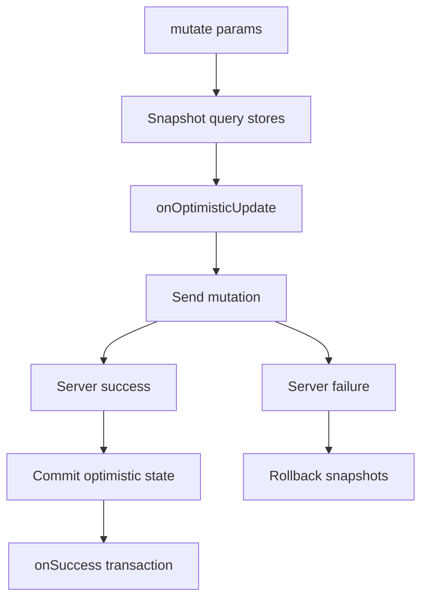

# Mutations

Client mutations wrap server mutation inputs, network execution, mutation state, optimistic updates, and success-time cache reconciliation.

## Create a mutation

```ts
export const createTicketMutation = tql.createMutation('createTicket', {
  mutationKey: 'createTicket',
  mutation: (params: CreateTicketParams) => ({
    workspaceId: params.workspaceId,
    ticketListId: params.ticketListId,
    title: params.title,
  }),
  onSuccess: ({ store, output }) => {
    store.getAll(ticketListsQuery).update((draft) => {
      const list = draft?.find((item) => item.id === output.ticket.ticketListId);
      list?.tickets.push(output.ticket);
    });
  },
});
```

The mutation name must exist in the generated `ClientSchema`. The `mutation()` function returns the server input payload for that mutation.

## Options

| Option | Description |
| --- | --- |
| `mutationKey` | Stable logical key for mutation state. |
| `mutation` | Function mapping UI params to server mutation input. |
| `onOptimisticUpdate` | Optional hook that updates query stores before the request resolves. |
| `onSuccess` | Optional hook that updates query stores after a successful server response. |
| `transport` | Optional transport override. |

There is no `onError` option in the current public mutation API.

## Optimistic update lifecycle



If the network request or server mutation fails, optimistic changes roll back to the snapshots captured before `onOptimisticUpdate`.

## `onSuccess` transaction

`onSuccess` runs in a separate store transaction after the mutation succeeds. If `onSuccess` throws, only the changes made by that hook are rolled back. The server mutation has already succeeded.

## Optimistic store API

Mutation hooks receive `store`, a typed facade over query and paged-query stores:

| Method | Purpose |
| --- | --- |
| `store.get(query, params)` | Target one query instance. |
| `store.where(query, partialParams)` | Target matching query instances. |
| `store.getAll(query)` | Target every active instance of a query. |
| `store.paged(query, params)` | Target one paged query instance. |
| `store.pagedWhere(query, partialParams)` | Target matching paged query instances. |
| `store.pagedAll(query)` | Target every active instance of a paged query. |

Targets support `.update(...)`. Paged targets also support list helpers such as adding to the start or end.

## Example: moving a ticket

`apps/app/src/api/tickets/mutations/move-ticket.mutation.ts` moves a ticket immediately, then reconciles with the server output:

```ts
export const moveTicketMutation = tql.createMutation('moveTicket', {
  mutationKey: 'moveTicket',
  mutation: (params: MoveTicketParams) => ({
    id: params.id,
    oldTicketListId: params.oldTicketListId,
    newTicketListId: params.newTicketListId,
  }),
  onOptimisticUpdate: ({ store, input }) => {
    const ticketLists = store.getAll(ticketListsQuery);

    ticketLists.update((draft) => {
      // Remove from the old list and push into the new list.
    });
  },
  onSuccess: ({ store, output }) => {
    store.getAll(ticketListsQuery).update((draft) => {
      // Replace the optimistic ticket with the server ticket.
    });
  },
});
```

This keeps board drag-and-drop responsive without giving up server-confirmed state.
