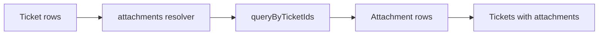

# Includes

Includes are typed relationships from one model to another. They let a client fetch nested data in one `/query` request while the server still resolves each relationship explicitly.

## Include types

Use `includeSingle` for one child row:

```ts
export const ticket = schema.model('ticket', {
  // ... schema, fields, allowEach, and queries

  includes: ({ includeSingle }) => ({
    assignee: includeSingle('ticketAssignee', {
      nullable: true,
      matchKey: 'ticketId',
      resolve: async ({ context, parents }) => {
        return ticketAssigneeService.queryByTicketIds(context.user, {
          ticketIds: parents.map((parent) => parent.id),
        });
      },
    }),
  }),
});
```

Use `includeMany` for many child rows:

```ts
export const ticket = schema.model('ticket', {
  // ... schema, fields, allowEach, and queries

  includes: ({ includeMany }) => ({
    attachments: includeMany('ticketAttachment', {
      matchKey: 'ticketId',
      query: z.object({
        order: z.enum(['asc', 'desc']),
      }),
      resolve: async ({ context, query, parents }) => {
        return ticketAttachmentsService.queryByTicketIds(context.user, {
          ticketIds: parents.map((parent) => parent.id),
          order: query.order,
        });
      },
    }),
  }),
});
```

## `matchKey`

`matchKey` is the child field that contains the parent id. In the example above, every `ticketAttachment` row has a `ticketId`. `tql` groups returned child rows by `ticketId` and stitches them back onto the matching ticket.

::: warning Preserve child order
For `includeMany`, return child rows in the exact order you want the client to receive them. `tql` groups rows by `matchKey`, but it does not invent a sort order inside each parent group. Apply ordering in your service or resolver before returning rows.
:::

## Batched resolution

Includes receive all selected parents at once:



This avoids one resolver call per parent and keeps relationship loading explicit.

## Include query args

Includes can define their own `query` schema. The client must provide a matching `query` object when selecting the include:

```ts
include: {
  attachments: {
    query: { order: 'asc' },
    select: {
      key: true,
      name: true,
      size: true,
    },
  },
}
```

If the include has no `query` schema, use `query: {}`.

## Nested includes

The target model's includes become available beneath the selected include. For example, if `workspaceMemberInvite` includes `workspace`, the client can fetch invites with their workspace:

```ts
include: {
  workspace: {
    query: {},
    select: {
      name: true,
    },
  },
}
```

Production servers should pair nested includes with the [Security](/plugins/built-in/security) plugin, especially `allowedShapes`, depth limits, breadth limits, and complexity budgets.

## Include authorization

Include rows pass through the target model's schema validation and `allowEach` guard. Include options can also define an `allow` guard for relationship-specific authorization.

Use model `allowEach` for broad row rules and include `allow` for relationship-specific constraints.
