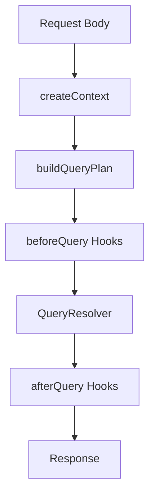
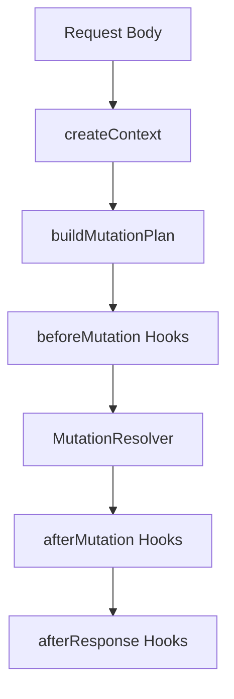

# Server Runtime

The `Server` class connects a registered `Schema` to HTTP, plugins, request context, query resolution, mutation resolution, and optional schema generation.

## Constructor

```ts
const server = new Server({
  schema,
  createContext,
  generateSchema: {
    enabled: true,
    outputPath: './__generated__/schema.d.ts',
  },
  logger,
  plugins,
});
```

`ServerOptions` includes:

| Option           | Description                                                                      |
| ---------------- | -------------------------------------------------------------------------------- |
| `schema`         | Required `Schema` instance with models and mutations registered.                 |
| `createContext`  | Required async function. Receives `{ request }` and returns app `SchemaContext`. |
| `generateSchema` | Optional codegen config. `false` disables generation.                            |
| `logger`         | Optional server logger.                                                          |
| `plugins`        | Optional `ServerPlugin[]`.                                                       |

## HTTP adapter

`@parabella-io/tql-server` ships a Fastify adapter:

```ts
tqlServer.attachHttp(createFastifyHttpAdapter(server));
```

The adapter registers:

- `POST /query`
- `POST /mutation`

The underlying `HttpAdapter` interface is transport-agnostic, so other HTTP frameworks can implement the same contract.

## Query request lifecycle



For each selected root query, the resolver:

1. Parses the query input.
2. Runs root `allow`.
3. Runs the root resolver.
4. Parses returned rows with the model Zod schema.
5. Runs `allowEach`.
6. Resolves selected includes and external fields.
7. Projects selected fields.

## Mutation request lifecycle



Mutations can return a `finalize()` step used by plugins with `afterResponse`, such as effects queues.

## Wire shape

A query body is keyed by query name:

```json
{
  "ticketById": {
    "query": { "id": "ticket_123" },
    "select": {
      "title": true,
      "description": true
    },
    "include": {
      "comments": {
        "query": { "order": "asc" },
        "select": { "content": true }
      }
    }
  }
}
```

A mutation body is keyed by mutation name:

```json
{
  "createTicket": {
    "input": {
      "workspaceId": "workspace_123",
      "ticketListId": "list_123",
      "title": "Write docs"
    }
  }
}
```

Responses are also keyed by operation name and contain `{ data, error }`. Query-many responses can also include `pagingInfo`.

## Errors

The runtime serializes framework errors as:

```ts
export type FormattedTQLServerError = {
  type: string;
  details?: Record<string, any>;
};
```
